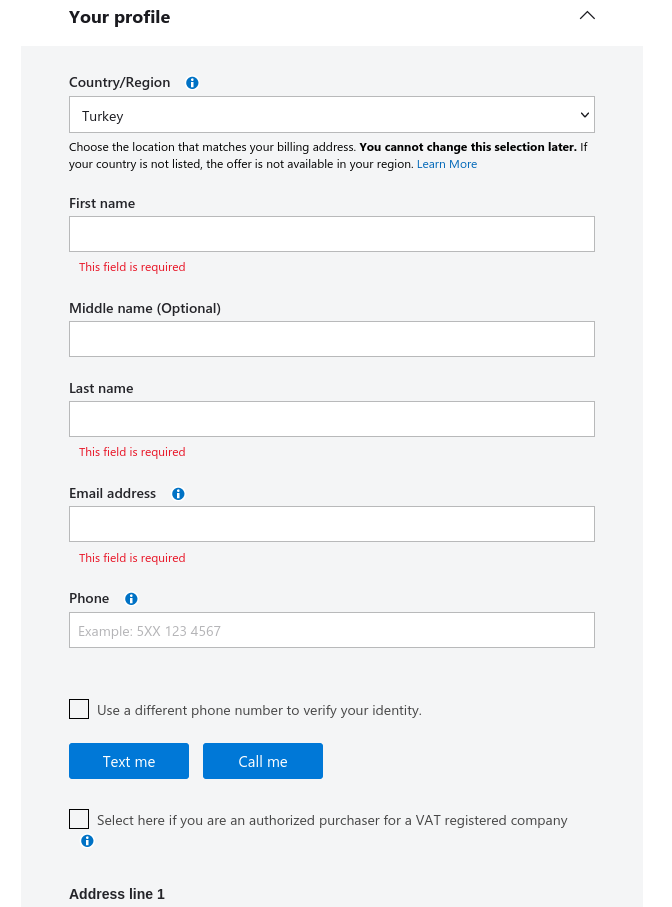
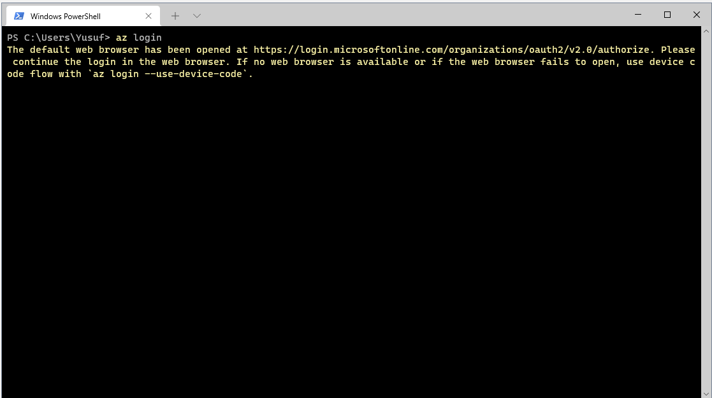

## [Azure Deployment guide for Machine Learning Zoomcamp](https://github.com/yusyel/mlbookcamp-code/blob/master/course-zoomcamp/README.md#5-deploying-machine-learning-models)

## 1. Creating Azure Account
Before you start you need Microsoft account.
If you do not have a microsoft account, you can sign up [here](https://account.microsoft.com/account/)

After creating an Microsoft account you can sign in for  [portal.azure.com](https://portal.azure.com/)

Azure Dashboard should like this:


For free Azure trial account click **Start** button.

Sign up form should like this:




After filling the form you need verify account with Credit or debit card. For credit card I've created <i>virtual credit</i> card and didn't have any issue for that. So I suggest to you same.

**Free Azure trial account**  offers: **$200** credit to use in your first **30 days**.

[These](https://portal.azure.com/#blade/Microsoft_Azure_Billing/FreeServicesBlade) are free service you can check out for limits.


## 2. Azure-Cli
Azure-cli azure command line based service manager tool.


## 2.1 Azure Cli for Debian Based Distribution
Azure-cli already in [Debian](https://packages.debian.org/bullseye/azure-cli) and [Ubuntu](https://packages.ubuntu.com/source/focal/azure-cli) repository.

For installing 
```
sudo apt-get install azure-cli
```

or if you want latest version of azure-cli you can add microsoft repository with this bash [script](https://docs.microsoft.com/en-us/cli/azure/install-azure-cli-linux?pivots=apt#option-1-install-with-one-command).

```bash
curl -sL https://aka.ms/InstallAzureCLIDeb | sudo bash
```

```bash
sudo apt update
sudo apt install azure-cli
```

## 2.2 Azure Cli For RPM Based Disribution

Import Microsoft repository key:

```
sudo rpm --import https://packages.microsoft.com/keys/microsoft.asc
```

Create local azure-cli repository information:

```
echo -e "[azure-cli]
name=Azure CLI
baseurl=https://packages.microsoft.com/yumrepos/azure-cli
enabled=1
gpgcheck=1
gpgkey=https://packages.microsoft.com/keys/microsoft.asc" | sudo tee /etc/yum.repos.d/azure-cli.repo
```

And install azure-cli with this commad.

```
sudo dnf install azure-cli
```


## 2.3 Azure Cli for Windows 10 or Windows 11

You can download [this](https://aka.ms/installazurecliwindows) MSI downloader. Once you downloaded you can use azure-cli with Powershell or Windows Command Prompt.

You can also use Windows Terminal which is azure-cli built in. You can download [here](https://www.microsoft.com/en-us/p/windows-terminal/9n0dx20hk701)

## 3. Log in Azure-cli

if you have successfully installed the azure-cli tool:

```bash
az login
```



Azure-cli will ask you to log-in your microsoft account in your default browser.

```bash
az account show
```
This command will show you the account information if you have successfully logged in.


## 4. Azure-cli Commands

### 4.1 Resource Group

Resource group is a container that holds related resources for an Azure service. Like docker container registry, web applications and many azure services.

```bash
az account list-locations | grep -i name
```
This bash command lists all locations. You can choose which locations nearest you.


The ```name``` line should be locations input variable.

For example: **East US 2**  input name should be ```centralus```


If you're using azure-cli on Windows Terminal this powershell command lists all locations.
```
az account list-locations | Select-String "name"
```
Output should be similar like above.


### 4.1.1 Creating Resource Group

```
az group create --name {group_name} --location westeurope
```


### 4.2.1 Creating Container registries

Azure Container Registry allows you to build, store, and manage docker container images in a private registry for all types of container deployments. 


```bash
az acr create --resource-group {group_name} --name {container_reg_name} --sku Basic
```
After ```--name ``` tag you **should choose unique** for docker container registry **name.** We're going to use login information for docker container repository when we push local docker container to azure docker container repository.

## 5. Login Azure container registry


If you have successfully created the container it's time to log in to the azure docker repository.

Before we start we need enable admin account for container registry. 

```bash
az acr update --name {container_reg_name} --admin-enabled true
```
Now we can use login token for docker container repository.

```bash
token=$(az acr login --name {container_reg_name} --expose-token --output tsv --query accessToken)
```
The return of this command also gives us little hint for docker login.

```
WARNING: You can perform manual login using the provided access token below, for example: 'docker login loginServer -u 00000000-0000-0000-0000-000000000000 -p accessToken'
```

We passed through login token to ```token``` varible.

Now we can use ```token``` to docker login. 

For that:

```bash
docker login {container_reg_name}.azurecr.io --username 00000000-0000-0000-0000-000000000000 --password $token
```

## 6. Pushing Local Docker image to Azure

Now it's time push local images to azure.

```bash
docker images
```
This docker command lists your local images. First we need tag image for azure container registry.

For that:

```
sudo docker tag {container_name} {container_reg_name}.azurecr.io/midterm:v1
```
<i>local container name</i> **>** <i> azure container registry name</i>

Container should be exists local docker images.

```bash
docker images
```
Now you can see under repository column your azure container repository.


For pushing docker container:

```
docker push {container_reg_name}.azurecr.io/{container_name}
```


## 7. Turning Docker Image to Azure Web Service

Before we turning docker image to Web service we need ```appservice plan```

Appservice is specifying web service OS, Region and SKU.

```
az appservice plan create --name {appservice_name} --resource-group {group_name} --is-linux --sku FREE
```

```
az webapp create --resource-group {group_name} --plan {appservice_name} --name {web_app_name}  --deployment-container-image-name {container_reg_name}.azurecr.io/{container_name}:v1
```
