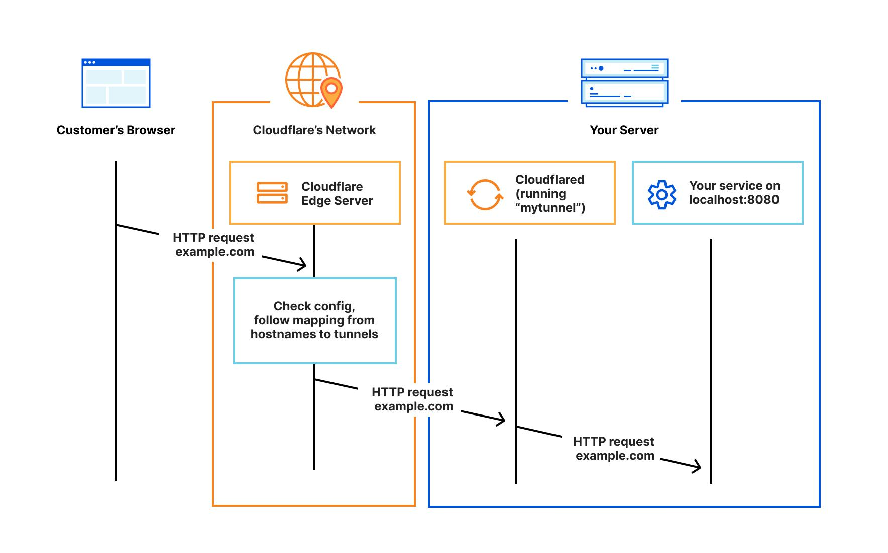
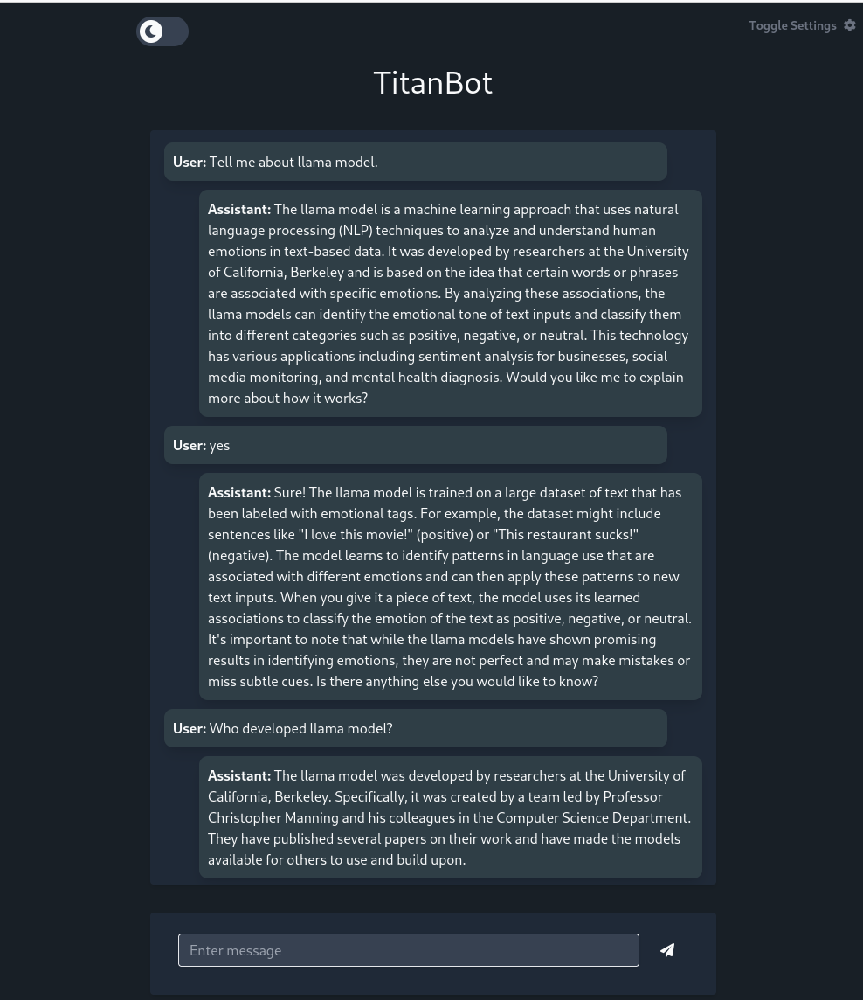

# Self-Hosting Large Language Models And Distributing With Cloudflare Tunnel
Titan ML's takeoff server allows you to host open-source large language models. The cool thing about the Takeoff Server is that it comes with optimization. The Takeoff Server utilizes intake quantization by default, taking high-precision weights and carefully tuning the precision so that it can represent them with much smaller weights. This optimization enables the model to run much faster and with significantly less memory usage.[*]

Cloudflare Tunnel is provides you with a secure way to connect your self hosted app without expose port or ip address.





In this guideline I will explain how to deploy takeoff server and distribute to others with cloudflare tunnel.

## Requirements:

* 4c/8t Vm has 32 GB ram. Least 150 GB free space. (this is the config I tested llama2-13b on cpu)
* Huggingface account and Access Token with read role. (for meta-llama2 model)
* Docker with non-root user.
* Huggingface Meta-Llama access (for metal-llama2 model)
* Cloudflare account
* Public domain address with cloudflare dns.

### Useful links:

https://docs.docker.com/engine/install/linux-postinstall/

https://ai.meta.com/resources/models-and-libraries/llama-downloads/ (Provided email address must same with huggingface account email.)

https://huggingface.co/meta-llama/Llama-2-13b-chat-hf

https://www.godaddy.com/community/Managing-Domains/Add-Cloudflare-nameservers-to-my-domain/m-p/31693


## Installing Takeoff Server

Make sure your favorite python environment enabled.

```bash
pip install titan-iris

```

Assuming you have access to llama2, to start the Takeoff server:


```bash
iris takeoff --model meta-llama/Llama-2-13b-chat-hf  --device cpu -t $huggingface_token 

```
If you have a Nvidia GPU change "cpu" to "cuda".


On your first run, the Takeoff server will prompt you to log in. You can sign in using the link provided in the console output

When you execute the 'iris takeoff' command, the Takeoff server will download the Docker image.

Expected output:


```logs
[Download f0412dfb1aae] ━━━━━━━━━━━━━━━━━━━━━╺━━━━━━━━━━━━━━━━━━  53% -:--:--
[Download 2863766b5fd4] ━━━━━━━━━━━━━━━━━━━━━━━━━━━━━━━━━━━━━━━━   0% -:--:--
[Download 827c444d8f44] ━━━━━━━━━━━━━━━━━━━━━━━━━━━━━━━━━━━━━━━━   0% -:--:--
[Extract  f0412dfb1aae] ━━━━━━━━━━━━━━━━━━━━━━━━━━━━━━━━━━━━━━━━ 100% 0:00:00
[Download 95ba63acee01] ━━━━━━━━━━━━━━━━━━━━━━━━━━━━━━━━━━━━━━━━ 100% 0:00:00
[Download 0f07d929085f] ━━━━━━━━━━━━━━━━━━━━━━━━━━━━━━━━━━━━━━━━   0% -:--:--
[Download b2a8770ba6a9] ━━━━━━━━━━━━━━━━━━━━━━━━━━━━━━━━━━━━━╸━━  95% 0:00:01
[Download 43149748d01f] ━━━━━━━━━━━━━━━━━━━━━━━━━━━━━━━━━━━━━━━╺  98% 0:00:01
[Download 2f0b806eac94] ━━━━━━━━━━━━━━━━━━━━━━━━━━━━━╺━━━━━━━━━━  73% 0:00:01
[Extract  2863766b5fd4] ━━━━━━━━━━━━━━━━━━━━━━━━━━━━━━━━━━━━━━━━ 100% 0:00:00
[Download 59e3789b30c5] ━━━━━━━━━━━━━━━━━━━━━━━━━━━━━━━━━━━━━━━━   0% -:--:--
[Extract  827c444d8f44] ━━━━━━━━━━━━━━━━━━━━━━━━━━━━━━━━━━━━━━━━ 100% 0:00:00
[Download 71913048c515] ━━━━━━━━━━━━━━━━━━━━━━━━━━━━━━━━━━━━━━━━   0% -:--:--
[Extract  0f07d929085f] ━━━━━━━━━━━━━━━━━━━━━━━━━━━━━━━━━━━━━━━━ 100% 0:00:00
[Extract  95ba63acee01] ━━━━━━━━━━━━━━━━━━━━━━━━━━━━━━━━━━━━━━━━ 100% 0:00:00
[Download 1aad5c79709e] ━━━━━━━━━━━━━━━━━━━━━━━━━━━━━━━━━━━━━━━╸ 100% 0:00:01
[Download 1737e1166973] ━━━━━━━━━━━━━━━━━━━━━━━━━━━━━━━━━━━━━━━━   0% -:--:--
[Download ae800d06e517] ━━━━━━━━━━━━━━━━━━━━━━━━━━━━━━━━━━━━━━━━ 100% 0:00:00
[Download f1148d07203b] ━━━━━━━━━━━━━━━━━━━━━━━━━━━━━━━━━━━━━━━━   0% -:--:--
[Extract  43149748d01f] ━━━━━━━━━━━━━━━━━━━━━━━━━━━━━━━━━━━━━━━━ 100% 0:00:00
[Extract  2f0b806eac94] ━━━━━━━━━━━━━━━━━━━━━━━━━━━━━━━━━━━━━━━━ 100% 0:00:00
[Extract  b2a8770ba6a9] ━━━━━━━━━━━━━━━━━━━━━━━━━━━━━━━━━━━━━━━━ 100% 0:00:00
[Extract  1737e1166973] ━━━━━━━━━━━━━━━━━━━━━━━━━━━━━━━━━━━━━━━━ 100% 0:00:00
[Extract  59e3789b30c5] ━━━━━━━━━━━━━━━━━━━━━━━━━━━━━━━━━━━━━━━━ 100% 0:00:00
[Extract  71913048c515] ━━━━━━━━━━━━━━━━━━━━━━━━━━━━━━━━━━━━━━━━ 100% 0:00:00
[Extract  1aad5c79709e] ━━━━━━━━━━━━━━━━━━━━━━━━━━━━━━━━━━━━━━━━ 100% 0:00:00
[Extract  ae800d06e517] ━━━━━━━━━━━━━━━━━━━━━━━━━━━━━━━━━━━━━━━━ 100% 0:00:00
[Extract  f1148d07203b] ━━━━━━━━━━━━━━━━━━━━━━━━━━━━━━━━━━━━━━━━ 100% 0:00:00

```

When the download is complete, Iris Takeoff will start the Docker container. The output gives you hints about the Docker container name and how to view the logs.

Expected output:

```logs

Starting takeoff server Llama-2-13b-chat-hf-VVLiPdjyjyUGbTFc4o9S6N-takeoff...
Takeoff Server Llama-2-13b-chat-hf-VVLiPdjyjyUGbTFc4o9S6N-takeoff started.
The server might take a few minutes to start while it optimizes your model.
You can check the progress of the optimization process by running:

docker logs Llama-2-13b-chat-hf-VVLiPdjyjyUGbTFc4o9S6N-takeoff -f

Once the server is ready, you can view the API docs at: http://localhost:8000/docs
For interactive demos, navigate to http://localhost:8000/demos/chat,         or http://localhost:8000/demos/playground 

Our docs are available online at https://docs.titanml.co/docs/intro
Join our community on Discord at https://discord.gg/83RmHTjZgf 

------------------------------------------------------------------------------------------------------------------------
Why settle for less when you can have Rust-enhanced performance? Try out our Rust-powered enhanced inference server on Titan Takeoff Pro Edition!

Titan Takeoff Pro Edition is the enterprise version of Titan Takeoff that comes with a host of features that will help you scale and optimise your inference deployments.
Our exclusive features include:

  - Multi-GPU Deployment - Scale up your inference deployments with multi-GPU support
  - Batch Processing - Process multiple requests at once
  - 4-bit Quantisation - Reduce memory usage and improve performance with 4-bit quantisation
  - Rust-enhanced Performance - Experience the power of Rust-enhanced performance
  - Logging support - Gain observability into your inference deployments with logging support

Interested? Explore our Pro features at https://docs.titanml.co/docs/titan-takeoff/pro-features/feature-comparison or reach out directly to our team at hello@titanml.co

```

We can view the steps of the Takeoff server by providing the Docker container names with:"

```bash
docker logs Llama-2-13b-chat-hf-VVLiPdjyjyUGbTFc4o9S6N-takeoff -f
```

First step is downloading model from huggingface. Then optimizing model. This is the part of you can observe resource usage. Like htop etc. If everything is fine, the Takeoff server will start the web applications.

Expected output:

```logs
docker logs Llama-2-13b-chat-hf-VVLiPdjyjyUGbTFc4o9S6N-takeoff -f
INFO:     Started server process [7]
INFO:     Waiting for application startup.
INFO:   Taking off!
INFO:   -----------------------
INFO:   Configuration
INFO:   -----------------------
INFO:   Model Name: meta-llama/Llama-2-13b-chat-hf
INFO:   Device: cpu
INFO:   -----------------------
INFO:   Starting model loader...
Downloading config.json: 100% 587/587 [00:00<00:00, 160kB/s]
INFO:   Downloading from meta-llama/Llama-2-13b-chat-hf
Downloading .gitattributes: 100% 1.58k/1.58k [00:00<00:00, 433kB/s]
Downloading generation_config.json: 100% 188/188 [00:00<00:00, 56.7kB/s]
Downloading README.md: 100% 10.4k/10.4k [00:00<00:00, 1.33MB/s]
Downloading LICENSE.txt: 100% 7.02k/7.02k [00:00<00:00, 2.05MB/s]
Downloading USE_POLICY.md: 100% 4.77k/4.77k [00:00<00:00, 1.34MB/s]]
Downloading (…)cial_tokens_map.json: 100% 414/414 [00:00<00:00, 236kB/s]
Downloading (…)model.bin.index.json: 100% 33.4k/33.4k [00:00<00:00, 10.2MB/s]
Downloading (…)nsible-Use-Guide.pdf: 100% 1.25M/1.25M [00:00<00:00, 18.0MB/s]
Downloading tokenizer.json: 100% 1.84M/1.84M [00:00<00:00, 26.9MB/s]
Downloading tokenizer_config.json: 100% 1.62k/1.62k [00:00<00:00, 879kB/s]/s]
Downloading tokenizer.model: 100% 500k/500k [00:00<00:00, 10.1MB/s] 79.5MB/s]
Downloading (…)l-00003-of-00003.bin: 100% 6.18G/6.18G [00:40<00:00, 152MB/s]
Downloading (…)l-00001-of-00003.bin: 100% 9.95G/9.95G [01:07<00:00, 148MB/s] 
Downloading (…)l-00002-of-00003.bin: 100% 9.90G/9.90G [01:10<00:00, 140MB/s] 
Fetching 15 files: 100% 15/15 [02:11<00:00,  8.75s/it][01:07<00:03, 127MB/s] 
INFO:   Optimizing CAUSAL model: /code/models/meta-llama/Llama-2-13b-chat-hf
INFO:   Modifying vocab for meta-llama/Llama-2-13b-chat-hf
INFO:   Running CT2 Converter...
The argument `trust_remote_code` is to be used with Auto classes. It has no effect here and is ignored.
Loading checkpoint shards: 100% 3/3 [00:42<00:00, 14.10s/it]
INFO:   CT2 Converter finished successfully
INFO:   Loading generator...
[2024-01-18 10:01:47.937] [ctranslate2] [thread 7] [warning] The compute type inferred from the saved model is int8_float16, but the target device or backend do not support efficient int8_float16 computation. The model weights have been automatically converted to use the int8_float32 compute type instead.
INFO:   Loading tokenizer...
INFO:   Optimization complete.
INFO:     Application startup complete.
INFO:     Uvicorn running on http://0.0.0.0:80 (Press CTRL+C to quit)

```

Now can use http://localhost:8000/demos/chat address to interactive demos.




