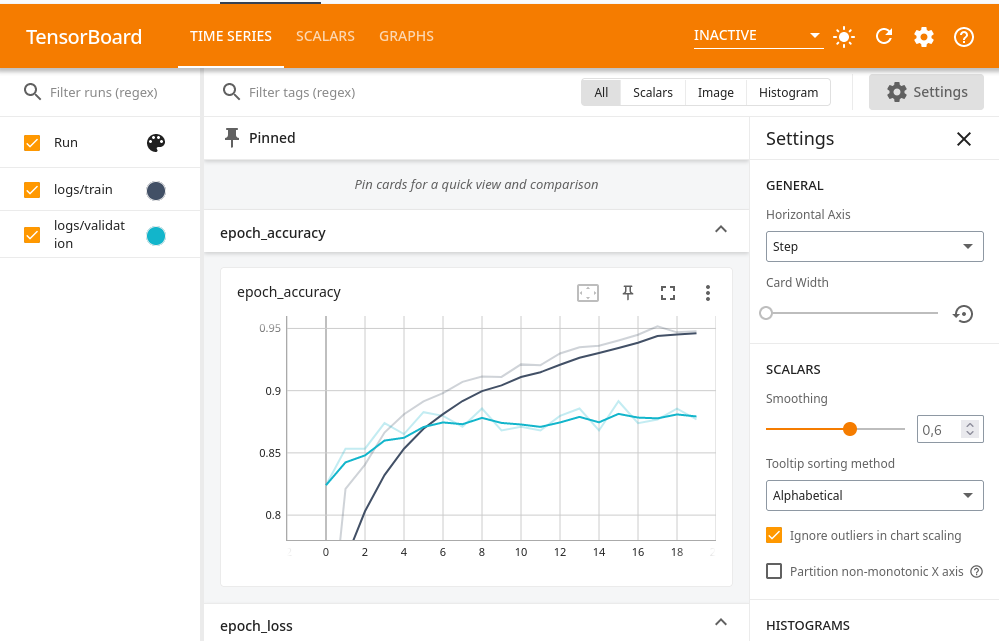
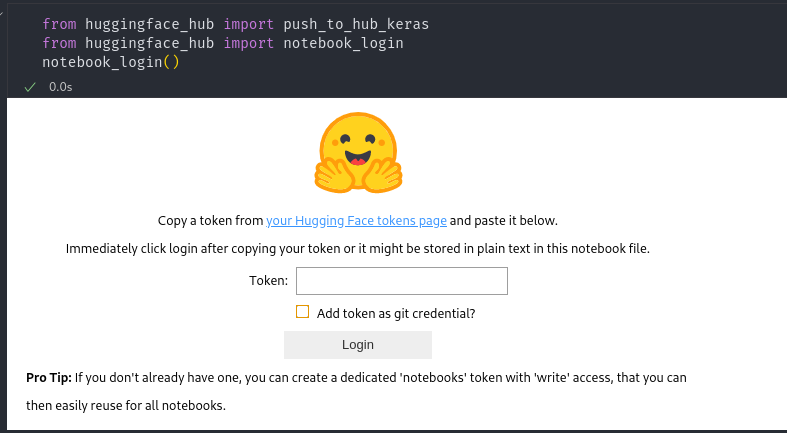

# Gradio Demonstration With Huggingface Space


If I have to describe Hugging Face one sentences that will be "it's like github but machine learning models". Ofcourse huggingface more than that. But it's enough for this guideline. Gradio is an open-source Python library that allows you to create web applications with such ease.


In this guideline, I will explain how to upload your machine learning model to Hugging Face and how to create Gradio demos.

The instructions consist of two steps. First making model ready to huggingface and creating gradio demo.


## Huggingface Model

### Making ready model

For CNN model I will use [Machine Learning Zoomcamp's](https://github.com/DataTalksClub/machine-learning-zoomcamp) Fashion classification last [model](https://github.com/DataTalksClub/machine-learning-zoomcamp/blob/master/08-deep-learning/notebook.ipynb)


Assuming you're compelling model step; additionly we need two callback. First one model checkpoint second one Tensorboard. TensorBoard is a tool for providing the measurements and visualizations needed during the machine learning workflow. In huggingface model page we can use this for visualizations.

This is how it looks:




### Tensorboard Callback

```python
log_dir="/home/jovyan/workspace/logs/fit"
callback=tf.keras.callbacks.TensorBoard(log_dir=log_dir,histogram_freq=0,
    write_graph=True,
    write_images=False,
    write_steps_per_second=False,
    update_freq='epoch',
    profile_batch=0,
    embeddings_freq=0,
    embeddings_metadata=None,)
```

### Checkpoint Callback
```python
path_checkpoint = f"/home/jovyan/workspace/xception_v4_1_{droprate}.h5"
modelckpt_callback = tf.keras.callbacks.ModelCheckpoint(
    monitor="val_accuracy",
    filepath=path_checkpoint,
    verbose=1,
    mode="max",
    save_weights_only=False,
    save_best_only=True)
```

Using two callbacks in 

```python
history = model.fit(train_ds, epochs=20, validation_data=val_ds,
                   callbacks=[callback, modelckpt_callback])

```
now model is ready to huggingface.

### Uploading Model to Huggingface

After signing in to Hugging Face, you will see a `+New` button. Click on it. A menu will appear with options for model, dataset, and space. Choose "Model." Enter the model name and click the "Create Model" button. Make sure the model name is straightforward. We will use this name when uploading the model. In huggingface page go to the settings and click `Access Tokens`. Create new token with `write` role.

Now return to Jupyter notebook and install `huggingface_hub`.

import huggingface hub and use notebook login. Like this:

```python
from huggingface_hub import push_to_hub_keras
from huggingface_hub import notebook_login
notebook_login()
```

Notebook login will create pop up like this:



Copy `access token` and click login button.

Now we are ready to push model to huggingface. For that we're going to use `push_to_hub_keras` function.

```python
push_to_hub_keras(model,
    "username/model_name",
    include_optimizer = True,
    tags = ["fashion"],
    log_dir = "/home/jovyan/workspace/logs/fit")
```

Executing this code will uploads model to huggingface along with logs.

Now we're ready to Gradio.

## Gradio

On the Hugging Face page, click the "New" button and choose "Space." Select "Gradio" for the "Space SDK" option. Click create space button. This will create a Git repository.

with 
```bash
git clone https://huggingface.co/spaces/username/space_name
```

Create `app.py` in repo folder. This will be python script for gradio.

importing necessary library:

```python
import gradio as gr
from huggingface_hub import from_pretrained_keras
from tensorflow.keras.preprocessing.image import load_img
from tensorflow.keras.preprocessing.image import img_to_array
from tensorflow.keras.preprocessing import image
import numpy as np
```

For downloading model from huggingface:
```python
model = from_pretrained_keras("yusyel/clothing")
```

Class names as list:

```python
class_names=["dress",
        "hat",
        "longsleee",
        "outwear",
        "pants",
        "shirt",
        "shoes",
        "shorts",
        "skirt",
        "t-shirt"]
```
Preprocessing and normalizing image:

```python
def preprocess_image(img):
    img = load_img(img, target_size=(299, 299, 3))
    img = image.img_to_array(img)
    img = np.expand_dims(img, axis=0)
    img /= 255.0
    print(img.shape)
    return img
```

And predict function. Returning class names and prediction:
```python
predict(img):
    img = preprocess_image(img)
    pred = model.predict(img)
    pred = np.squeeze(np.exp(pred)/np.sum(np.exp(pred))).astype(float)
    print(dict(zip(class_names, pred)))
    return dict(zip(class_names, pred))
```


Gradio block:

```python
demo = gr.Interface(
    fn=predict,
    inputs=[gr.inputs.Image(type="filepath")],
    outputs=gr.outputs.Label(),
    examples=[
        ["./img/Black_Sea_Sprat.png"],
        ["./img/Gilt_Head_Bream.JPG"],
        ["./img/Horse_Mackerel.png"],
        ["./img/Red_mullet.png"],
        ["./img/Red_Sea_Bream.JPG"],
        ["./img/Sea_Bass.JPG"],
        ["./img/Shrimp.png"],
        ["./img/Striped_Red_Mullet.png"],
        ["./img/Trout.png"],
    ],
    title="Fashion Classification",
)
demo.launch(server_name="0.0.0.0", server_port=7860)
```
make sure you copied examples images in img folder. Gradio function is `fn=predict` and we want outpus as as label `gr.outputs.Label()`


Now we can launch gradio demo with  `python3 app.py`

After running python script: `Running on local URL:  http://0.0.0.0:7860`

we can launch demo with local url.


## Pusing Git repos to Huggingface Space

If everything is ok. We're ready to pusing gradio demo to hugging face space. for that: 

before pushing gradio demo. We need `requirements.txt` file. Create `requirements.txt` in git repo folder.
requriments python library should looks like this:


```
gradio==3.41.0
numpy==1.23.3
tensorflow==2.9.1
```

Now we're ready to push gradio demo to huggingface space. For that:

```bash 
git add * . 
git commit -m "first push" 
git push 
```

After 5 minutes for building space should look like this:

[Fashion Classification](https://huggingface.co/spaces/yusyel/clothing)