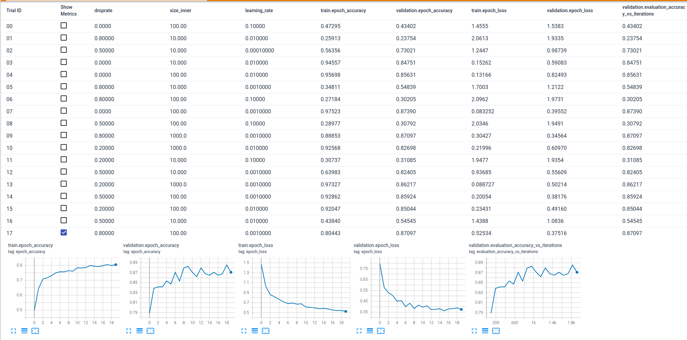

## Hyperparameter Search With Keras-tuners

Hypermeter search is crucial for deep learning project. In this guideline I will explain how to use keras-tuner for hypermeter search.

In the [machine learning](https://github.com/DataTalksClub/machine-learning-zoomcamp/tree/master/08-deep-learning) course instructor used the `learning rate`, `size of inner layer` and `dropout` hyperparameters. Now we're using this parameters with keras-tuner.

### Installing Keras-tuner

For installing keras-tuner:

```bash
pip install keras-tuner
```

### Importing Necessary Modules

For keras-tuner:

```python
import keras_tuner
from keras_tuner.tuners import RandomSearch
```

For tensorflow and Pre-trained convolutional neural networks:

```python
from tensorflow.keras.applications.xception import Xception
from tensorflow.keras.applications.xception import preprocess_input
from tensorflow.keras.applications.xception import decode_predictions
from tensorflow import keras
from tensorflow.keras.preprocessing.image import ImageDataGenerator
```

### Make Model Function

I will be using last model function from course. Additional we will be using keras-tuner. Hyperparameters table looks like this:


| 	learning rate	 | 	size of inner	 | 	dropput	 | 
| 	:-----:	 | 	:-----:	 | 	:-----:	 | 
| 	0.0001	| 	10	    | 	0.0	 | 
| 	0.001	| 	100	    | 	0.2	 | 
| 	0.01	| 	1000	| 	0.4	 | 
| 	0.1	    | 	    	| 	0.6	 | 
| 	    	| 	    	| 	0.8	 | 

Defining learning rate for parameteres:

```python
learning_rate = hp.Choice("learning_rate", values=[0.0001, 0.001, 0.01, 0.1])
```

Defining size of inner for parameters:

```python
size_inner= hp.Choice("size_inner", values = [10, 100, 1000])
```

Defining dropout for parameters:

```python
droprate = hp.Choice("droprate", values= [0.0, 0.2, 0.5, 0.8])
```
As an alternaive:

```python
droprate = hp.Int("droprate", min_value=0.0, max_value=0.8, step=0.2)
```

Final Make model functions looks like this:


```python
def make_model(hp):
    c.clear_session()
    base_model = Xception(
        weights='imagenet',
        include_top=False,
        input_shape=(299, 299, 3)
    )
    base_model.trainable = False
    inputs = keras.Input(shape=(299, 299, 3))
    base = base_model(inputs, training=False)
    vectors = keras.layers.GlobalAveragePooling2D()(base)
    # Size Inner Block
    size_inner= hp.Choice("size_inner", values = [10, 100, 1000])
    inner = keras.layers.Dense(size_inner, activation='relu')(vectors)
    
    #Droprate Block
    droprate = hp.Choice("droprate", values= [0.0, 0.2, 0.5, 0.8])
    drop = keras.layers.Dropout(droprate)(inner)


    
    outputs = keras.layers.Dense(10)(drop)
    model = keras.Model(inputs, outputs)
    
    # Learning Rate Block
    learning_rate = hp.Choice("learning_rate", values=[0.0001, 0.001, 0.01, 0.1])
    optimizer = keras.optimizers.Adam(learning_rate=learning_rate)
    loss = keras.losses.CategoricalCrossentropy(from_logits=True)

    model.compile(
        optimizer=optimizer,
        loss=loss,
        metrics=['accuracy']
    )
    return model
```
### Tensorboard Callback

[Tensorboard](https://www.tensorflow.org/tensorboard/get_started?hl=en) is a tool for providing the measurements and visualizations needed during the machine learning workflow. It enables tracking experiment metrics like loss and accuracy, visualizing the model graph, projecting embeddings to a lower dimensional space, and much more.

For this project we can visualize all trails like this:



```python
log_dir="/home/jovyan/workspace/logs/fit"
callback=tf.keras.callbacks.TensorBoard(log_dir=log_dir,histogram_freq=0,
write_graph=True,
write_images=False,
write_steps_per_second=False,
update_freq="epoch",
profile_batch=0,
embeddings_freq=0,
embeddings_metadata=None,)
```

### Hyperparameter Tuning

There is few options for hyperparameters search. Grid Search, Random Search and Bayesian Optimization.

#### Grid Search

Grid search is a systematic method where you specify a set of values for each hyperparameter you want to tune. It exhaustively evaluates all possible combinations of these values.* 

Grid search not efficient when considering time and computation cost. For example we're tuning learning rate alpha and hidden units. 4 value for learning rate and 4 value of hidden units. Turning in to the Grid:
```
[           units
    a   x   x   x   x
    l   x   x   x   x
    p   x   x   x   x
    h   x   x   x   x
    a
]
```
Learning rate is more important to the number of hidden units. If first two learning rate values bad hyperparameter for your model that means you spend 50% of time and computation cost for two bad values for this example.

#### Random Search

 Random search is a more efficient alternative to grid search. Instead of evaluating all possible combinations, it randomly samples from the hyperparameter space. It can often find good hyperparameters with fewer evaluations.*

#### Bayesian Optimization

Bayesian optimization uses probabilistic models to estimate the performance of different hyperparameter configurations. It selects new hyperparameter configurations to evaluate based on these estimates, aiming to find the optimal set efficiently.*


>* These are Chatgpt answer.

### Keras Tuner: Random Search

```python
tuner = RandomSearch(
    make_model,
    objective='val_accuracy',
    max_trials=25,
    directory='my_dir1') 
tuner.search_space_summary()
```

First we're passing model function `make_model` and criticism metric which is `val_accuracy`. Max trial is total number of trials. Directory is artifacts of trials.

Expected output:,

```
Search space summary
Default search space size: 3
size_inner (Choice)
{'default': 10, 'conditions': [], 'values': [10, 100, 1000], 'ordered': True}
droprate (Choice)
{'default': 0.0, 'conditions': [], 'values': [0.0, 0.2, 0.5, 0.8], 'ordered': True}
learning_rate (Choice)
{'default': 0.0001, 'conditions': [], 'values': [0.0001, 0.001, 0.01, 0.1], 'ordered': True}
```

For inner size: C(3,1), for droprate: C(4,1) and for learning rate: C(4,1). Total combination is 36. But we specified it 25. Keras tuner will trial randomly selected 25 combination of hyperparameters. It can be increased or decreased depending on the time and purpose.

Now we are ready to start trials. For that:

```python
tuner.search(train_ds, epochs=20, validation_data=val_ds, callbacks=[callback])
```

After trials end we can summarise all trials.

```python
tuner.results_summary()
```
Expected output

```
Trial 20 Complete [00h 22m 56s]
val_accuracy: 0.8856304883956909

Best val_accuracy So Far: 0.900293231010437
Total elapsed time: 07h 35m 27s
```

Listing best parameters.

```python
best_params = tuner.get_best_hyperparameters(1)[0]
print(best_params.values)
```
Now we're ready to use best parameters.

### Early Stop

Early stop useful feature when criticism metric reach saturation. Since we know our best accuracy we can use early stop to stopping training.


```python
early_stop =tf.keras.callbacks.EarlyStopping(
    monitor="val_accuracy",
    patience=5,
    verbose=0,
    mode="max",
    baseline=90,
    restore_best_weights=False,
)
```
Monitor is metric we use for model. Patince is Number of epochs with no improvement after which training will be stopped. Baseline value for the monitored quantity. Training will stop if the model doesn't show improvement over the baseline.

### Running With Best Parameters

```python
best_model = tuner.hypermodel.build(best_params)
history = best_model.fit(train_ds, epochs=50, validation_data=val_ds, callbacks=[callback, early_stop])
```

Development notebook is available in the repo folder.

